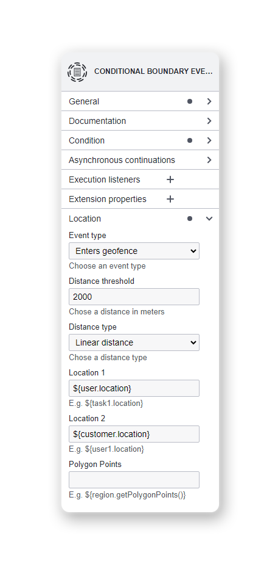
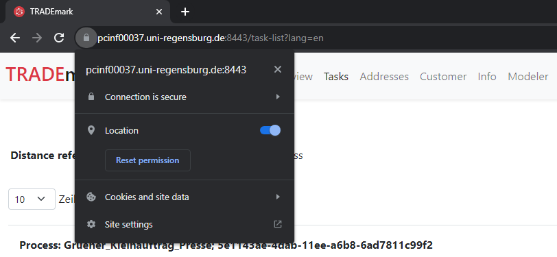

# TRADEmark - Using Location Data for Mobile Distributed Processes in BPM

> Leo Poss, Richard Jasinski, Michael Market and Stefan Schönig

_TRADEmark_ is a collection of tools designed to support the integration of contextual information within the domain of Business Process Management (BPM). In this demonstration, our primary focus is on harnessing location information throughout the modeling and execution phases of business processes. To achieve this, we employ a BPMN extension that encompasses various location-aware process elements, complemented by a mobile application developed using Flutter, and a backend with a web application responsible for executing the logic within a Business Process Management System. This approach enables a transition from conventional tools that cater to specific tasks or companies towards the adoption of dynamically adaptive tools. Moreover, it facilitates the seamless incorporation of Internet of Things (IoT) devices and the processing of the data they generate.

## Demonstration environment

You can access the demonstration environment at https://pcinf00037.uni-regensburg.de:8443/ using `test` and `Test!2023` as credentials.

## Demonstration video (YouTube)

https://www.youtube.com/watch?v=OztHKFD8bOc

## Modeler

As the de facto standard for modeling business processes, BPMN is the modeling language of choice for this demonstration. BPMN is based on XML files and a standardized meta-model that allows for custom extensions. Depending on the chosen Business Process Management System (BPMS), support for standard elements, as well as extension elements following the meta-model, may need adjustments to ensure executability.

The modeler presented here is an extension of the open-source BPMN viewer and editor bpmn.js (https://bpmn.io/toolkit/bpmn-js/). Upon logging into TRADEmark, the location-aware modeler is accessible under the "Modeler" tab.

From this interface, users have the option to create a new diagram or simply drag and drop the `location-aware business process.bpmn` file into the window.

_Overview of the modeler: Toolbox on the left, location-awaree business process in the center and properties panel on the right_

From there, you can edit the process model as usual, with no modifications made to standard elements. Regarding location-aware elements: Depending on the required type for the actual execution, the title in the properties panel (and the icon) may occasionally not correspond to the location-aware element. However, once an _event type_ for location-aware events or a _location operator_ for allocation and assignment is selected, the icon will promptly update to accurately reflect the incorporation of location data into the BPMN element.

   
_Properties panel of location boundary event and location-based task allocation including specific properties needed for execution_

Finally, you have the option to either download the .xml file for the corresponding process model or export it as an .svg image from the bottom left corner.

## Mobile-Application

Utilized by field workers, the application necessitates certain permissions upon its initial launch. Specifically, the user must grant two distinct permissions. The location permission facilitates device tracking, while the Bluetooth permission enables the identification of devices in close proximity to the user.

The mobile application comprises various distinct views, namely:

- Tasks
- Processes
- Location
- Bluetooth
- Settings

In the subsequent sections, we shortly explain each of these views.

### Tasks

The tasks view displays all available user tasks for the currently selected user. Users have the option to assign tasks to themselves, complete forms associated with the tasks, unassign tasks, or mark them as completed.

### Processes

The processes view allows users to initiate various processes, subject to their permissions.

### Location

The location tab provides real-time information about the current location of the mobile device in use. It also offers functionality to send this location data to the backend server for documentation purposes or to open a map on the mobile device for further reference.

### Bluetooth

In the Bluetooth view, users can identify other Bluetooth devices within proximity of their mobile device.

### Settings

The settings tab serves the purpose of selecting the current user and specifying the application's language.

## Web Application

Utilized by office workers to track locations of devices and handle customer data.
After logging into the application, a landing page is shown:

Here we can see that the application is split into different parts:

- Location
- Devices
- Project Overview
- Tasks
- Addresses
- Customer
- Info
- Modeler

These sections will be described in detail in the following sections.

### Location

This is the content of the landing page of the web application and shows the latest location of all different devices. At the bottom of the screen, all devices are listed by their UUID, name, latitude, longitude, and timestamp.
Clicking on the corresponding action buttons of a device allows users to focus the map on the latest device location or to only show the selected device and a history of its locations on the map.

### Devices

On the devices page, all created devices are shown. This view enables users to edit the device, allowing them to change the name, description, or type of the device, to show the locations of the device on the map, which links to the location page, or to simply delete the device.

### Project Overview

This page shows a simple overview of all open user tasks and consists of task ID, task name, assignee, creation date, description, and the process definition name this task is associated with.

### Tasks

The tasks tab shows all user tasks that are currently available and allows users to assign themselves to a task, unassign it, or complete it. Furthermore, they are able to start different processes or show task-specific forms or user information. Users can also switch the distance reference between their own location and the company address.

### Addresses

The addresses view shows all saved addresses. Addresses consist of street, house number, zip code, city, latitude, and longitude, address-specific information, and whether the address is the company address or not.
Here, users are allowed to edit the address, view it on the map, or show the customer associated with this address.

### Customer

On the customer page, users can see all existing customers. Each customer can be edited, viewed in detail, and their home address can be shown.

### Info

This page simply displays all saved context information.

### Modeler

Redirects to the modeler page, which was described earlier.

### Troubleshooting

- Receiving a `GeolocationPositionError`
  - Please verify that your browser grants location permissions

